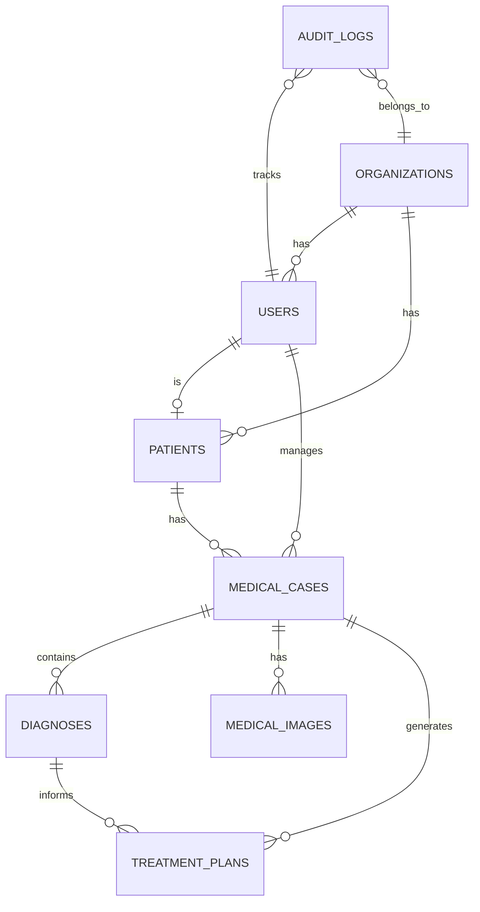
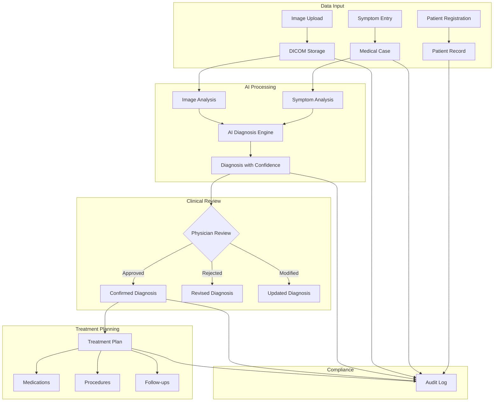
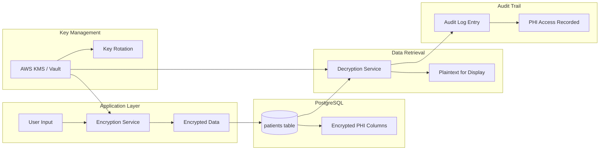
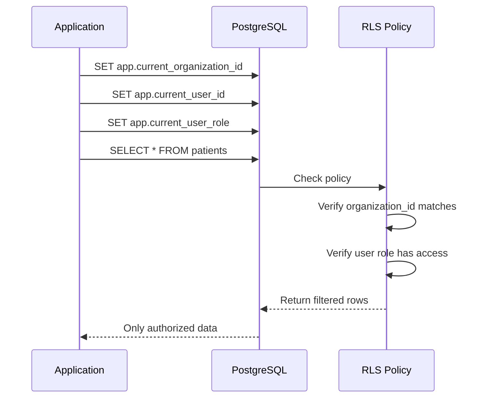

# NEURAXIS Database Entity-Relationship Diagram

This document contains the Mermaid diagram for the NEURAXIS database schema.

## Full Schema Diagram

```mermaid
erDiagram
    %% ============================================
    %% NEURAXIS - Medical Diagnosis Platform
    %% Entity-Relationship Diagram
    %% ============================================

    ORGANIZATIONS {
        uuid id PK
        varchar name
        varchar legal_name
        varchar type
        varchar email UK
        varchar phone
        varchar website
        varchar address_line1
        varchar city
        varchar state
        varchar postal_code
        varchar country
        varchar npi_number
        varchar tax_id
        date hipaa_compliance_date
        jsonb settings
        boolean is_active
        timestamptz created_at
        timestamptz updated_at
        timestamptz deleted_at
    }

    USERS {
        uuid id PK
        uuid organization_id FK
        varchar email UK
        varchar password_hash
        varchar first_name
        varchar last_name
        enum role
        enum status
        varchar title
        varchar specialization
        varchar license_number
        varchar npi_number
        varchar dea_number
        varchar phone
        boolean mfa_enabled
        bytea mfa_secret_encrypted
        timestamptz last_login_at
        inet last_login_ip
        int failed_login_attempts
        jsonb preferences
        timestamptz created_at
        timestamptz updated_at
    }

    PATIENTS {
        uuid id PK
        uuid organization_id FK
        uuid user_id FK
        varchar mrn UK
        bytea first_name_encrypted "PHI - AES-256"
        bytea last_name_encrypted "PHI - AES-256"
        bytea date_of_birth_encrypted "PHI - AES-256"
        bytea ssn_encrypted "PHI - AES-256"
        varchar gender
        bytea email_encrypted "PHI"
        bytea phone_encrypted "PHI"
        bytea address_encrypted "PHI"
        bytea emergency_contact_encrypted "PHI"
        bytea insurance_encrypted "PHI"
        varchar blood_type
        jsonb allergies
        jsonb chronic_conditions
        jsonb current_medications
        jsonb surgical_history
        jsonb family_history
        jsonb vitals
        uuid primary_physician_id FK
        jsonb care_team
        boolean is_active
        timestamptz created_at
        timestamptz updated_at
    }

    MEDICAL_CASES {
        uuid id PK
        uuid organization_id FK
        uuid patient_id FK
        varchar case_number UK
        varchar title
        text description
        text chief_complaint
        varchar case_type
        varchar specialty
        enum priority
        enum status
        uuid assigned_physician_id FK
        uuid created_by_id FK
        date admission_date
        date discharge_date
        jsonb subjective "SOAP - S"
        jsonb objective "SOAP - O"
        jsonb assessment "SOAP - A"
        jsonb plan "SOAP - P"
        jsonb metadata
        text_array tags
        text_array icd_codes
        timestamptz created_at
        timestamptz updated_at
        timestamptz closed_at
    }

    DIAGNOSES {
        uuid id PK
        uuid organization_id FK
        uuid case_id FK
        uuid patient_id FK
        boolean is_ai_generated
        varchar ai_model_version
        varchar ai_model_name
        varchar primary_diagnosis
        varchar icd_code
        varchar snomed_code
        decimal confidence_score "0.0000 - 1.0000"
        enum severity
        text reasoning
        jsonb supporting_evidence
        jsonb differential_diagnoses
        jsonb risk_factors
        jsonb contraindications
        jsonb recommended_tests
        jsonb recommended_treatments
        enum status
        uuid reviewed_by_id FK
        timestamptz reviewed_at
        text review_notes
        varchar final_diagnosis
        varchar final_icd_code
        int processing_time_ms
        varchar input_data_hash
        timestamptz created_at
        timestamptz updated_at
    }

    MEDICAL_IMAGES {
        uuid id PK
        uuid organization_id FK
        uuid case_id FK
        uuid patient_id FK
        varchar accession_number
        enum image_type
        varchar body_region
        varchar laterality
        varchar view_position
        jsonb dicom_metadata
        varchar study_instance_uid
        varchar series_instance_uid
        varchar sop_instance_uid
        varchar storage_provider
        varchar storage_bucket
        varchar storage_key
        text storage_url
        varchar file_name
        bigint file_size_bytes
        varchar mime_type
        varchar checksum_sha256
        enum status
        jsonb ai_analysis
        timestamptz ai_analyzed_at
        text radiologist_notes
        text findings
        text impression
        uuid reported_by_id FK
        uuid uploaded_by_id FK
        timestamptz study_date
        timestamptz created_at
        timestamptz updated_at
    }

    MEDICATIONS {
        uuid id PK
        varchar ndc_code UK
        varchar rxcui
        varchar generic_name
        text_array brand_names
        varchar drug_class
        varchar therapeutic_class
        varchar pharmacological_class
        varchar dosage_form
        varchar strength
        varchar route
        text description
        jsonb indications
        jsonb contraindications
        jsonb warnings
        jsonb interactions
        jsonb side_effects
        jsonb dosing_guidelines
        varchar schedule "DEA Schedule"
        boolean requires_prescription
        boolean is_active
        date fda_approval_date
        timestamptz created_at
        timestamptz updated_at
    }

    TREATMENT_PLANS {
        uuid id PK
        uuid organization_id FK
        uuid case_id FK
        uuid patient_id FK
        uuid diagnosis_id FK
        varchar title
        text description
        enum status
        jsonb medications
        jsonb procedures
        jsonb lab_orders
        jsonb imaging_orders
        jsonb referrals
        jsonb follow_ups
        text patient_instructions
        text dietary_restrictions
        text activity_restrictions
        jsonb treatment_goals
        jsonb expected_outcomes
        uuid created_by_id FK
        uuid approved_by_id FK
        timestamptz approved_at
        date start_date
        date expected_end_date
        date actual_end_date
        text clinical_notes
        timestamptz created_at
        timestamptz updated_at
    }

    AUDIT_LOGS {
        uuid id PK
        uuid user_id FK
        varchar user_email
        enum user_role
        uuid organization_id FK
        enum action
        varchar resource_type
        uuid resource_id
        varchar resource_description
        jsonb changes
        inet ip_address
        text user_agent
        uuid request_id
        uuid session_id
        varchar endpoint
        varchar http_method
        varchar request_body_hash
        boolean success
        text error_message
        boolean accessed_phi "HIPAA Required"
        text_array phi_fields_accessed
        timestamptz created_at "IMMUTABLE"
    }

    %% ============================================
    %% RELATIONSHIPS
    %% ============================================

    ORGANIZATIONS ||--o{ USERS : "employs"
    ORGANIZATIONS ||--o{ PATIENTS : "treats"
    ORGANIZATIONS ||--o{ MEDICAL_CASES : "manages"
    ORGANIZATIONS ||--o{ DIAGNOSES : "records"
    ORGANIZATIONS ||--o{ MEDICAL_IMAGES : "stores"
    ORGANIZATIONS ||--o{ TREATMENT_PLANS : "creates"
    ORGANIZATIONS ||--o{ AUDIT_LOGS : "logs"

    USERS ||--o| PATIENTS : "portal_account"
    USERS ||--o{ PATIENTS : "primary_physician"
    USERS ||--o{ MEDICAL_CASES : "assigned_to"
    USERS ||--o{ MEDICAL_CASES : "created_by"
    USERS ||--o{ DIAGNOSES : "reviewed_by"
    USERS ||--o{ MEDICAL_IMAGES : "reported_by"
    USERS ||--o{ MEDICAL_IMAGES : "uploaded_by"
    USERS ||--o{ TREATMENT_PLANS : "created_by"
    USERS ||--o{ TREATMENT_PLANS : "approved_by"
    USERS ||--o{ AUDIT_LOGS : "performed_by"

    PATIENTS ||--o{ MEDICAL_CASES : "has"
    PATIENTS ||--o{ DIAGNOSES : "receives"
    PATIENTS ||--o{ MEDICAL_IMAGES : "owns"
    PATIENTS ||--o{ TREATMENT_PLANS : "follows"

    MEDICAL_CASES ||--o{ DIAGNOSES : "contains"
    MEDICAL_CASES ||--o{ MEDICAL_IMAGES : "includes"
    MEDICAL_CASES ||--o{ TREATMENT_PLANS : "has"

    DIAGNOSES ||--o{ TREATMENT_PLANS : "informs"
```

## Simplified View - Core Entities

## Data Flow Diagram

## PHI Data Flow

## Row-Level Security Flow

